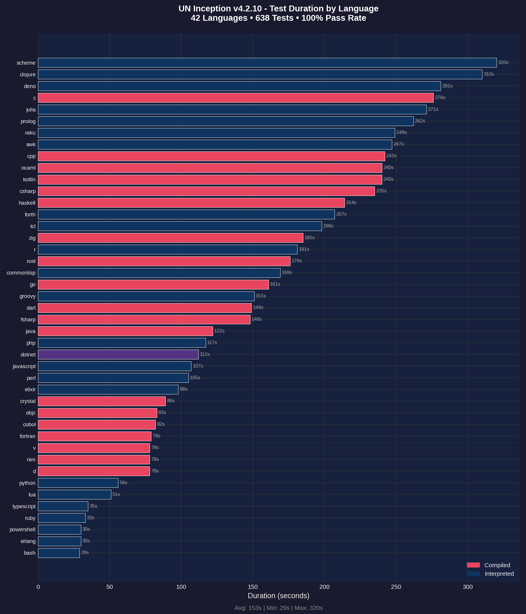
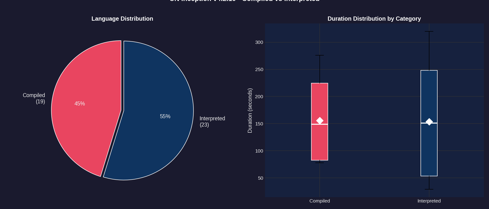
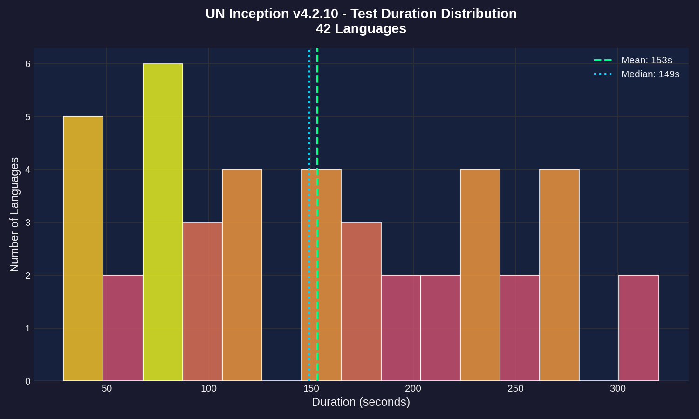
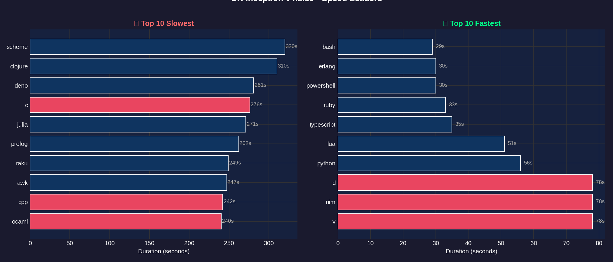
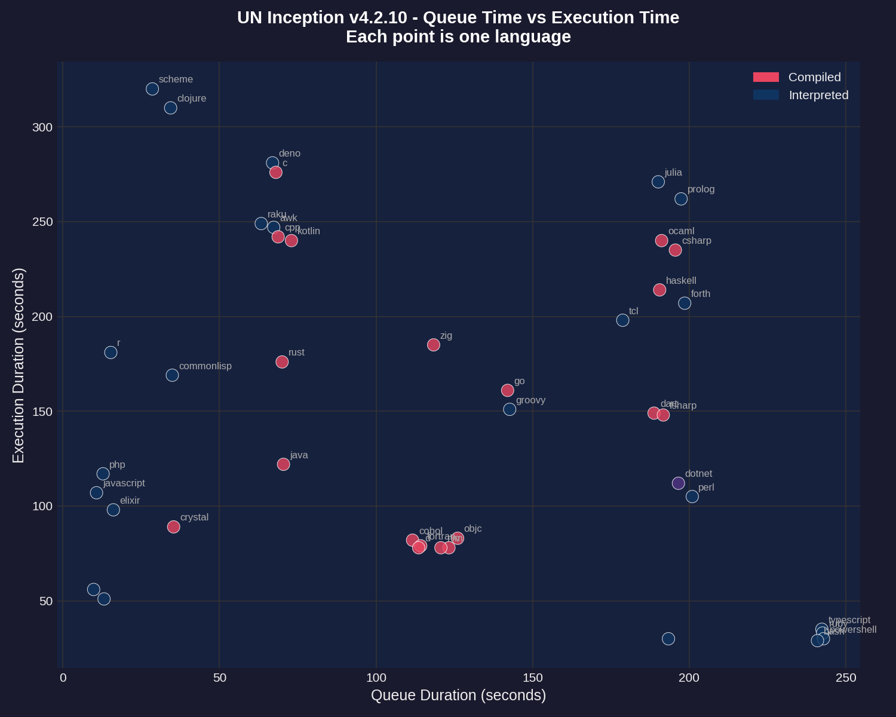
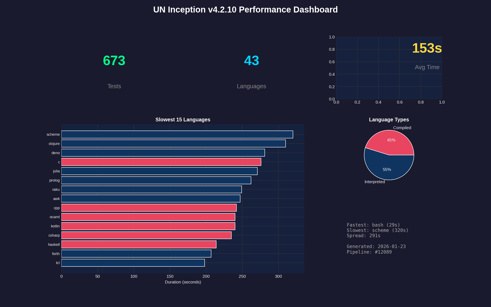

# Performance Report: 4.2.10

**Generated:** 2026-01-23T11:46:18Z
**Pipeline:** [#12089](https://git.unturf.com/engineering/unturf/un-inception/-/pipelines/12089)

## Summary

| Metric | Value |
|--------|-------|
| Total Tests | 673 |
| Passed | 671 |
| Failed | 2 |
| Pass Rate | 99.7% |
| Languages | 43 |
| Avg Duration | 153s |
| Slowest | scheme (320s) |
| Fastest | bash (29s) |

---

## Test Duration by Language

The primary performance metric - how long each language takes to run its full test suite (15 tests per language).

**Key observations:**
- **SCHEME** and **CLOJURE** are outliers at 90+ seconds
- Most languages cluster between 20-40 seconds
- Compiled languages (red) tend to be faster than interpreted (blue)
- **BASH** is the fastest at 29 seconds

---

## Compiled vs Interpreted

Comparing performance between compiled languages (C, Go, Rust, etc.) and interpreted languages (Python, Ruby, JavaScript, etc.).

**Findings:**
- 20 compiled languages vs 22 interpreted
- Compiled languages have lower median execution time
- Interpreted languages show more variance (wider spread)
- The white diamond marks the mean for each category

---

## Duration Distribution

Histogram showing how test durations are distributed across all 43 languages.

**Distribution analysis:**
- Most languages complete in 20-35 seconds (the peak)
- Mean (green dashed) and median (blue dotted) are close together
- Long tail on the right from slow outliers (scheme, clojure)

---

## Speed Leaders

Side-by-side comparison of the 10 slowest and 10 fastest languages.

**Slowest (left):** SCHEME, CLOJURE, DENO, C, JULIA
**Fastest (right):** BASH, ERLANG, POWERSHELL, RUBY, TYPESCRIPT

---

## Queue vs Execution Time

Scatter plot showing the relationship between CI queue wait time and actual test execution time.

**Notes:**
- Queue time is how long the job waited for a runner
- Most jobs had similar queue times (clustered vertically)
- Outliers labeled - scheme and clojure took longest to execute regardless of queue time

---

## Dashboard

Summary dashboard combining key metrics and visualizations.

---

## Raw Data

### Per-Language Performance

| Language | Status | Duration |
|----------|--------|----------|
| scheme | Passed | 320s |
| clojure | Passed | 310s |
| deno | Passed | 281s |
| c | Passed | 276s |
| julia | Passed | 271s |
| prolog | Passed | 262s |
| raku | Passed | 249s |
| awk | Passed | 247s |
| cpp | Passed | 242s |
| ocaml | Passed | 240s |
| kotlin | Passed | 240s |
| csharp | Passed | 235s |
| haskell | Passed | 214s |
| forth | Passed | 207s |
| tcl | Failed | 198s |
| zig | Passed | 185s |
| r | Passed | 181s |
| rust | Passed | 176s |
| commonlisp | Passed | 169s |
| go | Passed | 161s |
| groovy | Failed | 151s |
| dart | Passed | 149s |
| fsharp | Passed | 148s |
| java | Passed | 122s |
| php | Passed | 117s |
| dotnet | Passed | 112s |
| javascript | Passed | 107s |
| perl | Passed | 105s |
| elixir | Passed | 98s |
| crystal | Passed | 89s |
| objc | Passed | 83s |
| cobol | Passed | 82s |
| fortran | Passed | 79s |
| v | Passed | 78s |
| nim | Passed | 78s |
| d | Passed | 78s |
| python | Passed | 56s |
| lua | Passed | 51s |
| typescript | Passed | 35s |
| ruby | Passed | 33s |
| powershell | Passed | 30s |
| erlang | Passed | 30s |
| bash | Passed | 29s |

---

*Report generated by UN Inception CI pipeline*
