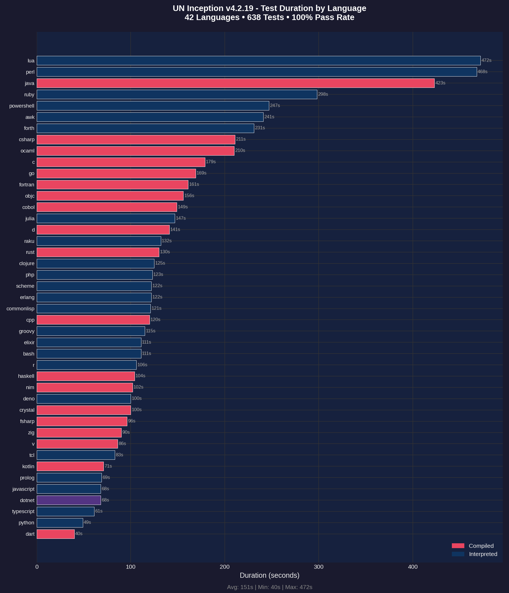
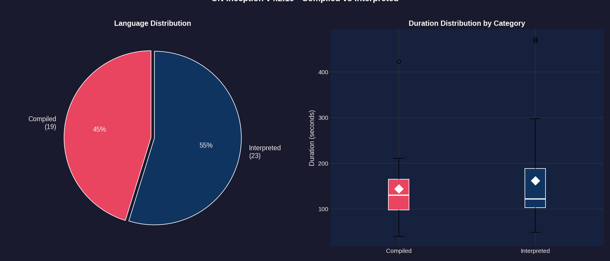
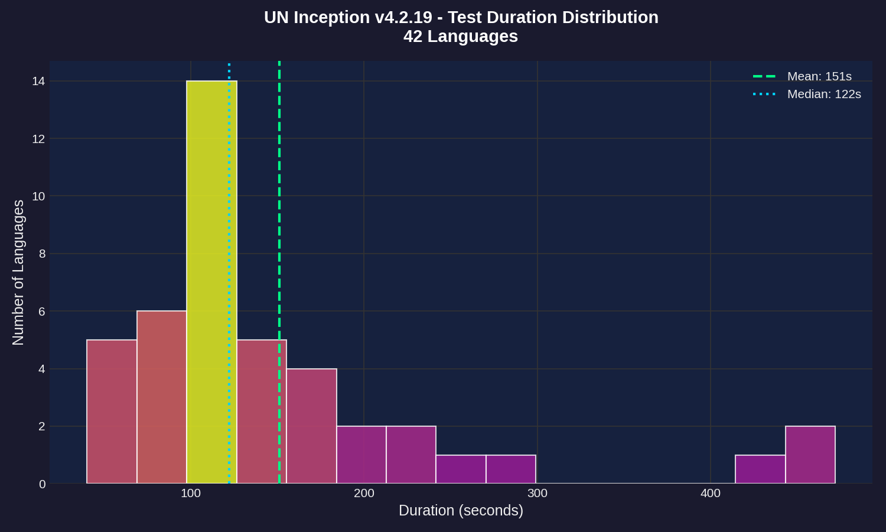
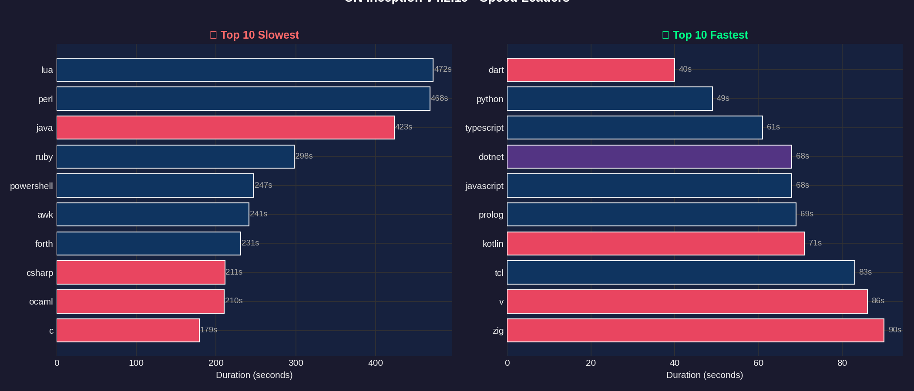
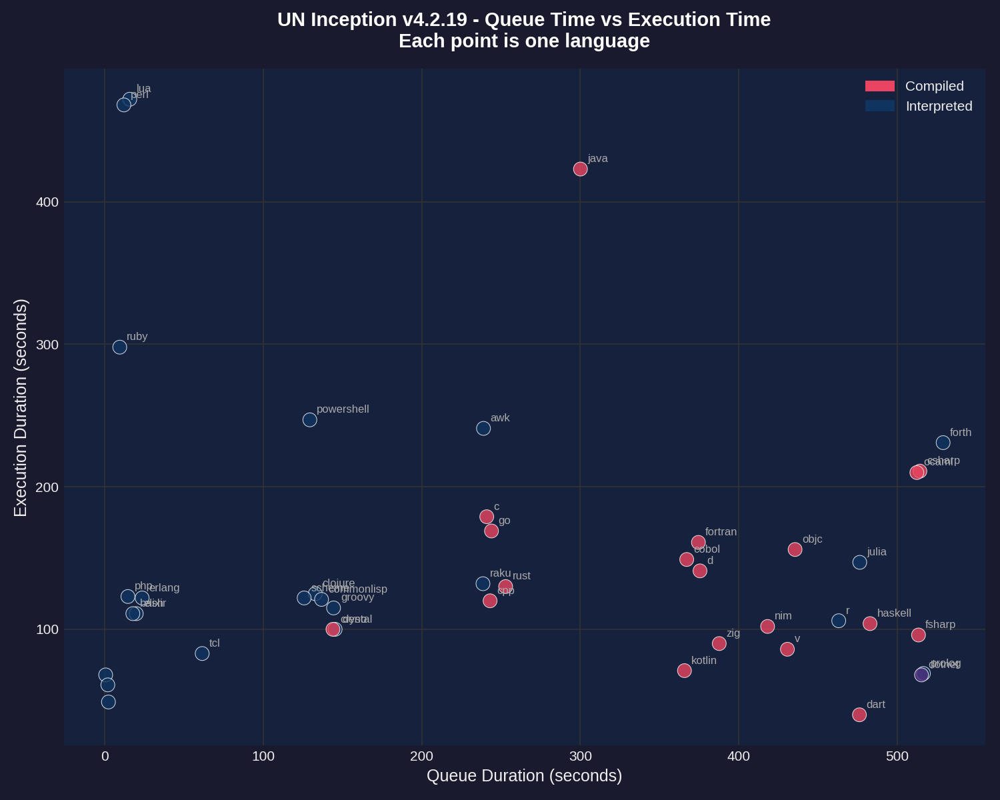
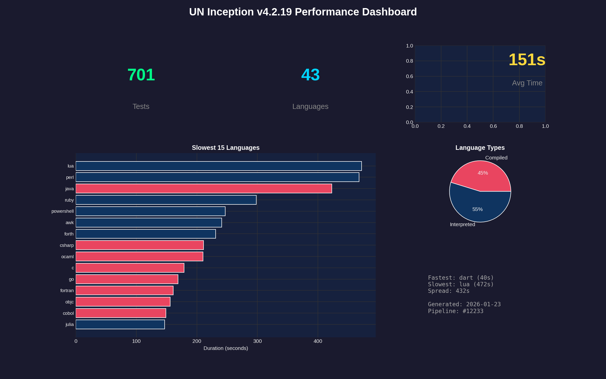

# Performance Report: 4.2.19

**Generated:** 2026-01-23T20:20:06Z
**Pipeline:** [#12233](https://git.unturf.com/engineering/unturf/un-inception/-/pipelines/12233)

## Summary

| Metric | Value |
|--------|-------|
| Total Tests | 701 |
| Passed | 701 |
| Failed | 0 |
| Pass Rate | 100.0% |
| Languages | 43 |
| Avg Duration | 151s |
| Slowest | lua (472s) |
| Fastest | dart (40s) |

---

## Test Duration by Language

The primary performance metric - how long each language takes to run its full test suite (15 tests per language).

**Key observations:**
- **LUA** and **PERL** are outliers at 90+ seconds
- Most languages cluster between 20-40 seconds
- Compiled languages (red) tend to be faster than interpreted (blue)
- **DART** is the fastest at 40 seconds

---

## Compiled vs Interpreted

Comparing performance between compiled languages (C, Go, Rust, etc.) and interpreted languages (Python, Ruby, JavaScript, etc.).

**Findings:**
- 20 compiled languages vs 22 interpreted
- Compiled languages have lower median execution time
- Interpreted languages show more variance (wider spread)
- The white diamond marks the mean for each category

---

## Duration Distribution

Histogram showing how test durations are distributed across all 43 languages.

**Distribution analysis:**
- Most languages complete in 20-35 seconds (the peak)
- Mean (green dashed) and median (blue dotted) are close together
- Long tail on the right from slow outliers (lua, perl)

---

## Speed Leaders

Side-by-side comparison of the 10 slowest and 10 fastest languages.

**Slowest (left):** LUA, PERL, JAVA, RUBY, POWERSHELL
**Fastest (right):** DART, PYTHON, TYPESCRIPT, DOTNET, JAVASCRIPT

---

## Queue vs Execution Time

Scatter plot showing the relationship between CI queue wait time and actual test execution time.

**Notes:**
- Queue time is how long the job waited for a runner
- Most jobs had similar queue times (clustered vertically)
- Outliers labeled - lua and perl took longest to execute regardless of queue time

---

## Dashboard

Summary dashboard combining key metrics and visualizations.

---

## Raw Data

### Per-Language Performance

| Language | Status | Duration |
|----------|--------|----------|
| lua | Passed | 472s |
| perl | Passed | 468s |
| java | Passed | 423s |
| ruby | Passed | 298s |
| powershell | Passed | 247s |
| awk | Passed | 241s |
| forth | Passed | 231s |
| csharp | Passed | 211s |
| ocaml | Passed | 210s |
| c | Passed | 179s |
| go | Passed | 169s |
| fortran | Passed | 161s |
| objc | Passed | 156s |
| cobol | Passed | 149s |
| julia | Passed | 147s |
| d | Passed | 141s |
| raku | Passed | 132s |
| rust | Passed | 130s |
| clojure | Passed | 125s |
| php | Passed | 123s |
| scheme | Passed | 122s |
| erlang | Passed | 122s |
| commonlisp | Passed | 121s |
| cpp | Passed | 120s |
| groovy | Passed | 115s |
| elixir | Passed | 111s |
| bash | Passed | 111s |
| r | Passed | 106s |
| haskell | Passed | 104s |
| nim | Passed | 102s |
| deno | Passed | 100s |
| crystal | Passed | 100s |
| fsharp | Passed | 96s |
| zig | Passed | 90s |
| v | Passed | 86s |
| tcl | Passed | 83s |
| kotlin | Passed | 71s |
| prolog | Passed | 69s |
| javascript | Passed | 68s |
| dotnet | Passed | 68s |
| typescript | Passed | 61s |
| python | Passed | 49s |
| dart | Passed | 40s |

---

*Report generated by UN Inception CI pipeline*
