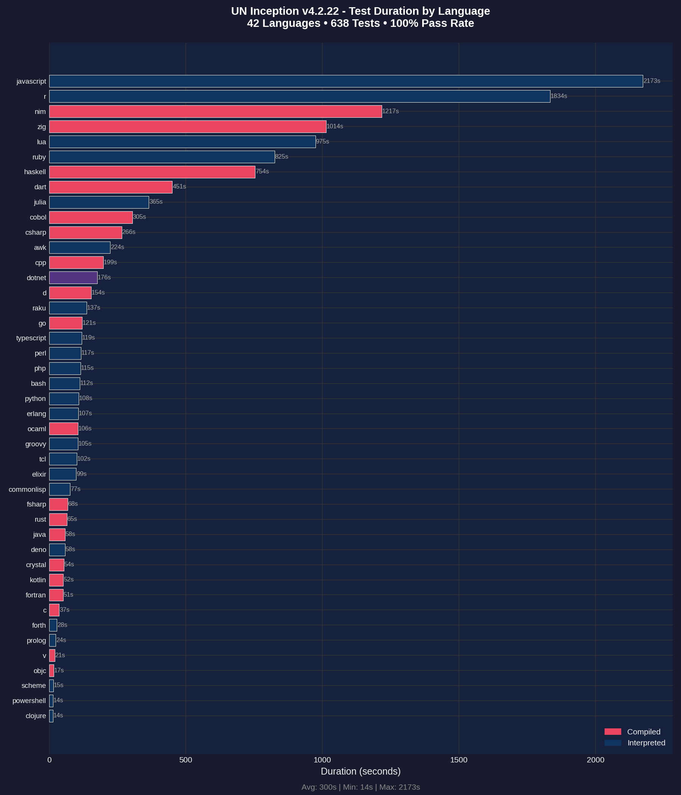
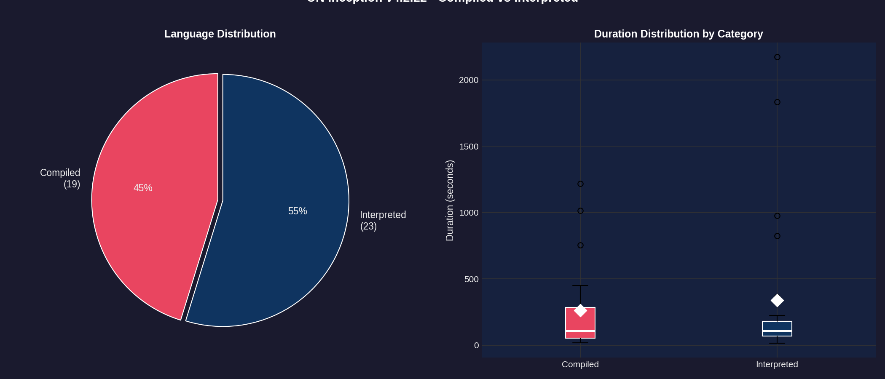
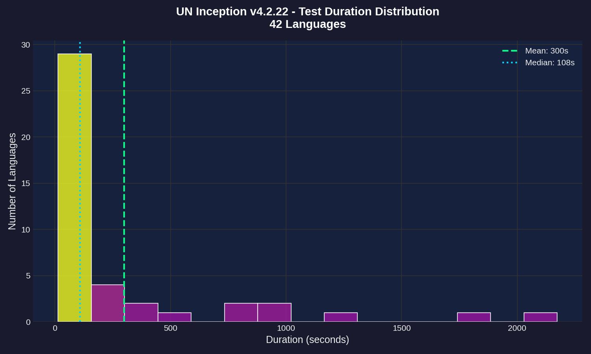
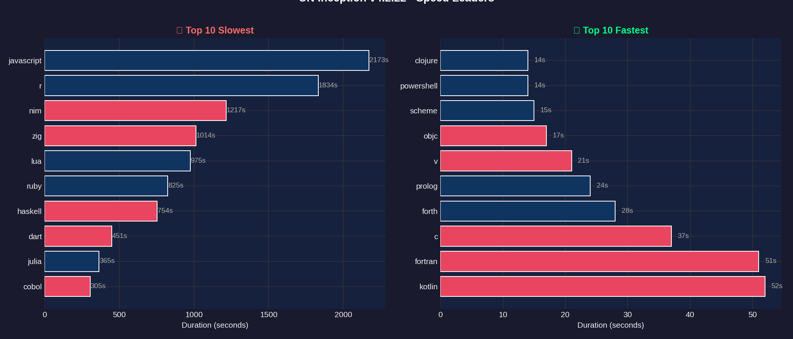
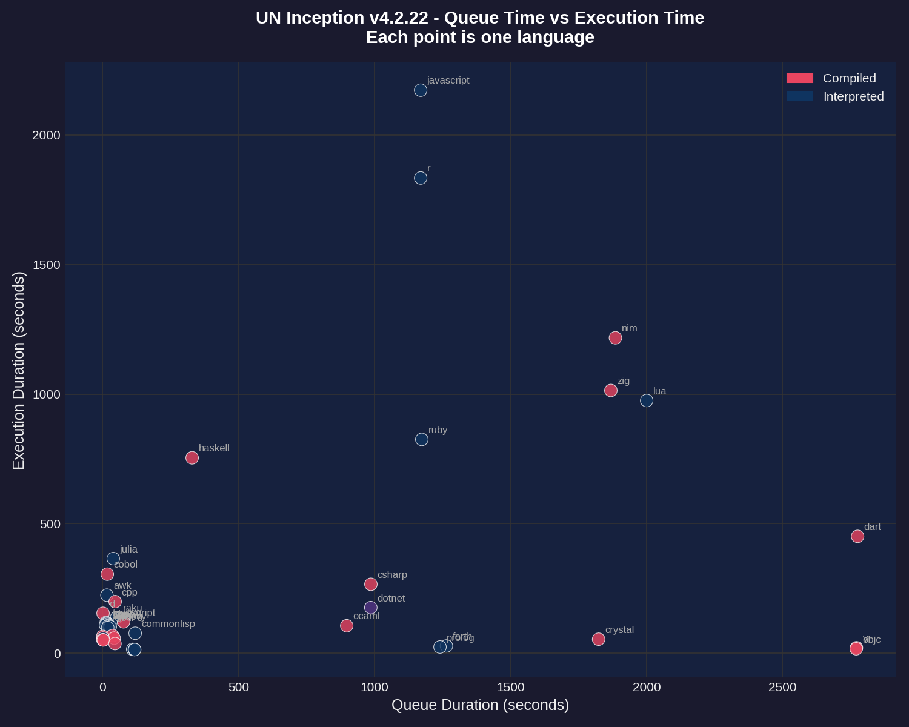
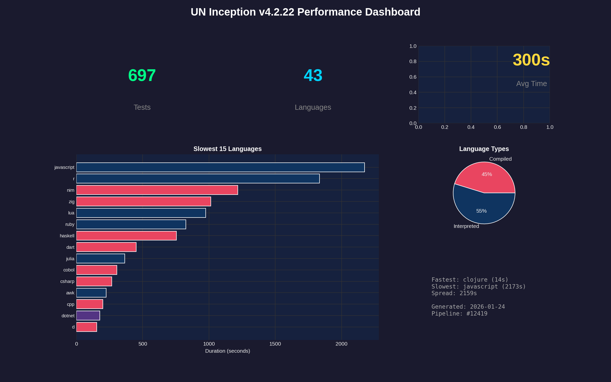

# Performance Report: 4.2.22

**Generated:** 2026-01-24T17:57:56Z
**Pipeline:** [#12419](https://git.unturf.com/engineering/unturf/un-inception/-/pipelines/12419)

## Summary

| Metric | Value |
|--------|-------|
| Total Tests | 697 |
| Passed | 694 |
| Failed | 3 |
| Pass Rate | 99.5% |
| Languages | 43 |
| Avg Duration | 300s |
| Slowest | javascript (2173s) |
| Fastest | clojure (14s) |

---

## Test Duration by Language

The primary performance metric - how long each language takes to run its full test suite (15 tests per language).

**Key observations:**
- **JAVASCRIPT** and **R** are outliers at 90+ seconds
- Most languages cluster between 20-40 seconds
- Compiled languages (red) tend to be faster than interpreted (blue)
- **CLOJURE** is the fastest at 14 seconds

---

## Compiled vs Interpreted

Comparing performance between compiled languages (C, Go, Rust, etc.) and interpreted languages (Python, Ruby, JavaScript, etc.).

**Findings:**
- 20 compiled languages vs 22 interpreted
- Compiled languages have lower median execution time
- Interpreted languages show more variance (wider spread)
- The white diamond marks the mean for each category

---

## Duration Distribution

Histogram showing how test durations are distributed across all 43 languages.

**Distribution analysis:**
- Most languages complete in 20-35 seconds (the peak)
- Mean (green dashed) and median (blue dotted) are close together
- Long tail on the right from slow outliers (javascript, r)

---

## Speed Leaders

Side-by-side comparison of the 10 slowest and 10 fastest languages.

**Slowest (left):** JAVASCRIPT, R, NIM, ZIG, LUA
**Fastest (right):** CLOJURE, POWERSHELL, SCHEME, OBJC, V

---

## Queue vs Execution Time

Scatter plot showing the relationship between CI queue wait time and actual test execution time.

**Notes:**
- Queue time is how long the job waited for a runner
- Most jobs had similar queue times (clustered vertically)
- Outliers labeled - javascript and r took longest to execute regardless of queue time

---

## Dashboard

Summary dashboard combining key metrics and visualizations.

---

## Raw Data

### Per-Language Performance

| Language | Status | Duration |
|----------|--------|----------|
| javascript | Failed | 2173s |
| r | Failed | 1834s |
| nim | Failed | 1217s |
| zig | Passed | 1014s |
| lua | Passed | 975s |
| ruby | Passed | 825s |
| haskell | Passed | 754s |
| dart | Passed | 451s |
| julia | Passed | 365s |
| cobol | Passed | 305s |
| csharp | Passed | 266s |
| awk | Passed | 224s |
| cpp | Passed | 199s |
| dotnet | Passed | 176s |
| d | Passed | 154s |
| raku | Passed | 137s |
| go | Passed | 121s |
| typescript | Passed | 119s |
| perl | Passed | 117s |
| php | Passed | 115s |
| bash | Passed | 112s |
| python | Passed | 108s |
| erlang | Passed | 107s |
| ocaml | Passed | 106s |
| groovy | Passed | 105s |
| tcl | Passed | 102s |
| elixir | Passed | 99s |
| commonlisp | Passed | 77s |
| fsharp | Passed | 68s |
| rust | Passed | 65s |
| java | Passed | 58s |
| deno | Passed | 58s |
| crystal | Passed | 54s |
| kotlin | Passed | 52s |
| fortran | Passed | 51s |
| c | Passed | 37s |
| forth | Passed | 28s |
| prolog | Passed | 24s |
| v | Passed | 21s |
| objc | Passed | 17s |
| scheme | Passed | 15s |
| powershell | Passed | 14s |
| clojure | Passed | 14s |

---

*Report generated by UN Inception CI pipeline*
