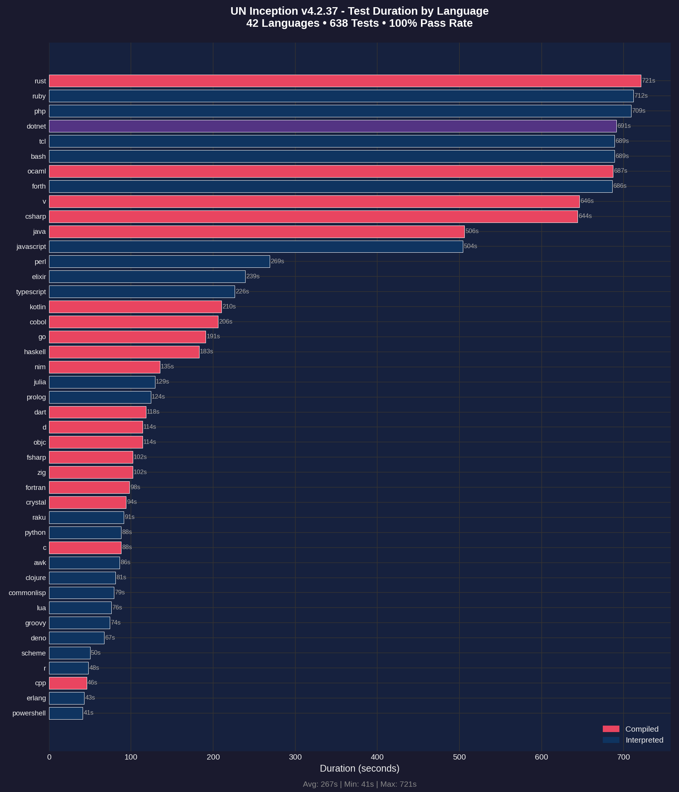
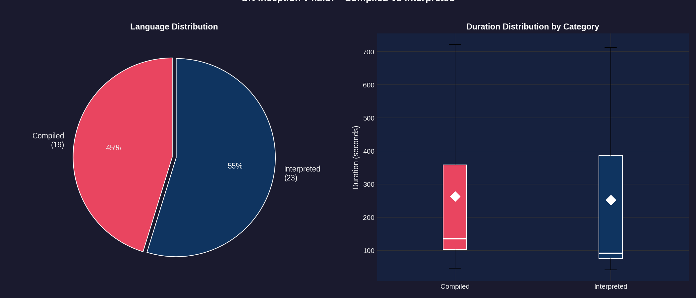
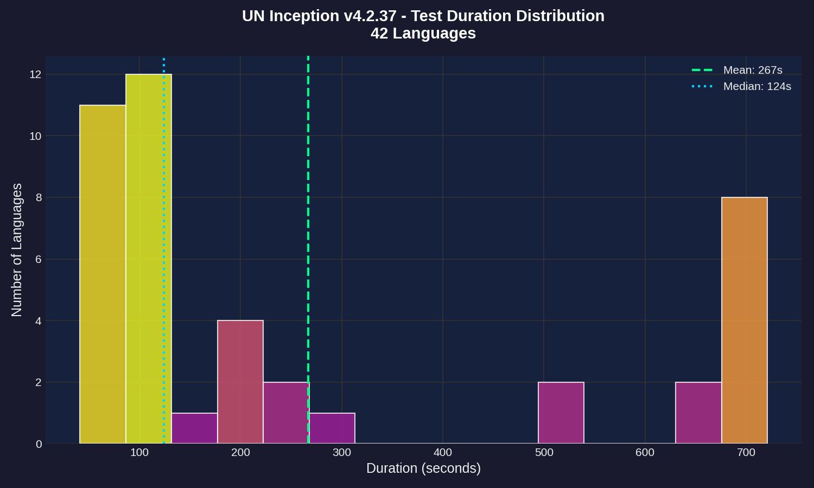
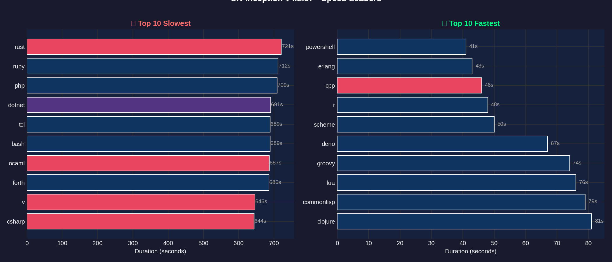
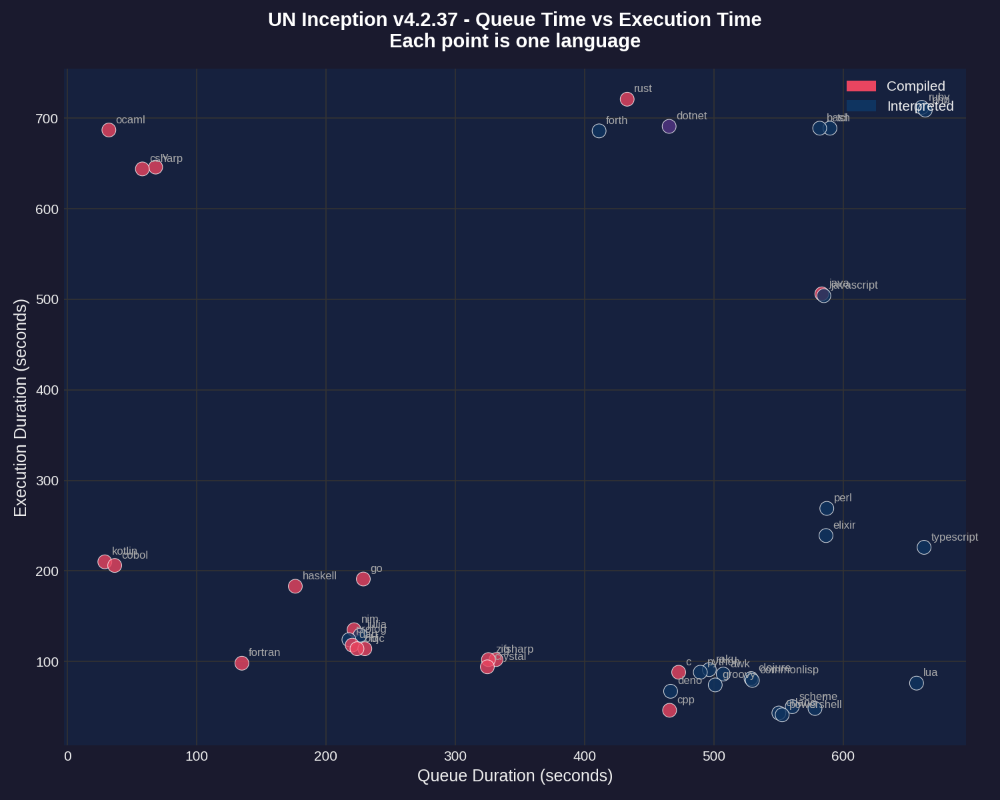
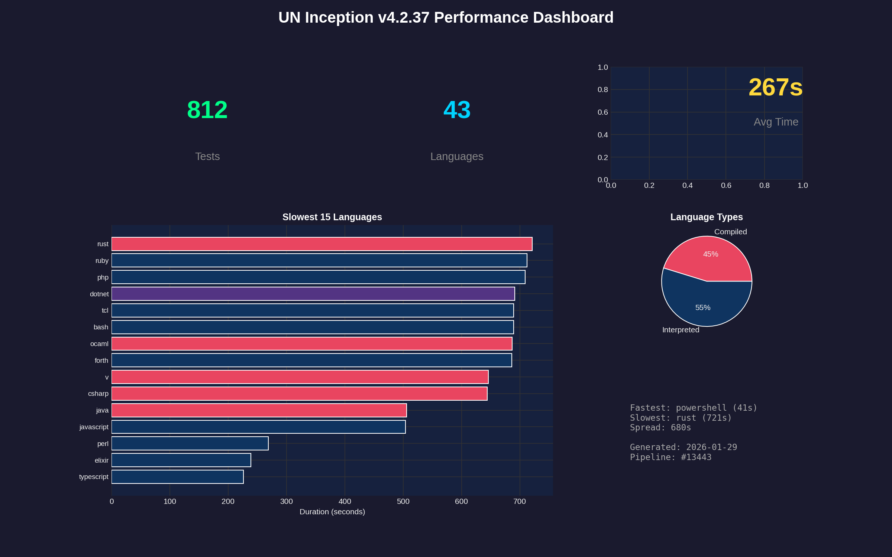

# Performance Report: 4.2.37

**Generated:** 2026-01-29T13:55:52Z
**Pipeline:** [#13443](https://git.unturf.com/engineering/unturf/un-inception/-/pipelines/13443)

## Summary

| Metric | Value |
|--------|-------|
| Total Tests | 812 |
| Passed | 718 |
| Failed | 94 |
| Pass Rate | 88.4% |
| Languages | 43 |
| Avg Duration | 267s |
| Slowest | rust (721s) |
| Fastest | powershell (41s) |

---

## API Health

Tracks transient errors encountered during test execution. Tests retry on failures to ensure accurate results.

| Metric | Value |
|--------|-------|
| Health Score | 0/100 |
| Total Retries | 151 |
| Rate Limit (429) | 0 |
| Server Error (5xx) | 60 |
| Timeout | 0 |
| Connection | 0 |
| Tests Needing Retries | 18 |

**Interpretation:**
- **Score 95-100:** API is healthy, minimal transient errors
- **Score 80-94:** Some API instability, but tests recovered via retry
- **Score < 80:** Significant API issues affecting test reliability

---

## Test Duration by Language

The primary performance metric - how long each language takes to run its full test suite (15 tests per language).

**Key observations:**
- **RUST** and **RUBY** are outliers at 90+ seconds
- Most languages cluster between 20-40 seconds
- Compiled languages (red) tend to be faster than interpreted (blue)
- **POWERSHELL** is the fastest at 41 seconds

---

## Compiled vs Interpreted

Comparing performance between compiled languages (C, Go, Rust, etc.) and interpreted languages (Python, Ruby, JavaScript, etc.).

**Findings:**
- 20 compiled languages vs 22 interpreted
- Compiled languages have lower median execution time
- Interpreted languages show more variance (wider spread)
- The white diamond marks the mean for each category

---

## Duration Distribution

Histogram showing how test durations are distributed across all 43 languages.

**Distribution analysis:**
- Most languages complete in 20-35 seconds (the peak)
- Mean (green dashed) and median (blue dotted) are close together
- Long tail on the right from slow outliers (rust, ruby)

---

## Speed Leaders

Side-by-side comparison of the 10 slowest and 10 fastest languages.

**Slowest (left):** RUST, RUBY, PHP, DOTNET, TCL
**Fastest (right):** POWERSHELL, ERLANG, CPP, R, SCHEME

---

## Queue vs Execution Time

Scatter plot showing the relationship between CI queue wait time and actual test execution time.

**Notes:**
- Queue time is how long the job waited for a runner
- Most jobs had similar queue times (clustered vertically)
- Outliers labeled - rust and ruby took longest to execute regardless of queue time

---

## Dashboard

Summary dashboard combining key metrics and visualizations.

---

## Raw Data

### Per-Language Performance

| Language | Status | Duration |
|----------|--------|----------|
| rust | Failed | 721s |
| ruby | Failed | 712s |
| php | Failed | 709s |
| dotnet | Failed | 691s |
| tcl | Failed | 689s |
| bash | Failed | 689s |
| ocaml | Failed | 687s |
| forth | Failed | 686s |
| v | Failed | 646s |
| csharp | Failed | 644s |
| java | Failed | 506s |
| javascript | Failed | 504s |
| perl | Failed | 269s |
| elixir | Failed | 239s |
| typescript | Failed | 226s |
| kotlin | Failed | 210s |
| cobol | Failed | 206s |
| go | Failed | 191s |
| haskell | Failed | 183s |
| nim | Passed | 135s |
| julia | Failed | 129s |
| prolog | Passed | 124s |
| dart | Failed | 118s |
| d | Passed | 114s |
| objc | Failed | 114s |
| fsharp | Passed | 102s |
| zig | Failed | 102s |
| fortran | Passed | 98s |
| crystal | Passed | 94s |
| raku | Failed | 91s |
| python | Failed | 88s |
| c | Failed | 88s |
| awk | Failed | 86s |
| clojure | Failed | 81s |
| commonlisp | Failed | 79s |
| lua | Failed | 76s |
| groovy | Passed | 74s |
| deno | Failed | 67s |
| scheme | Failed | 50s |
| r | Failed | 48s |
| cpp | Passed | 46s |
| erlang | Failed | 43s |
| powershell | Failed | 41s |

---

*Report generated by UN Inception CI pipeline*
