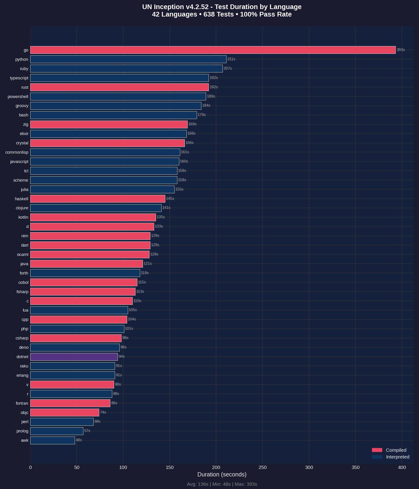
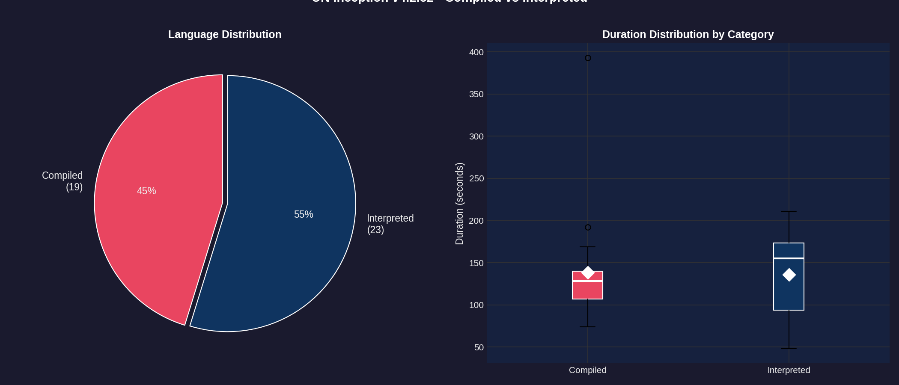
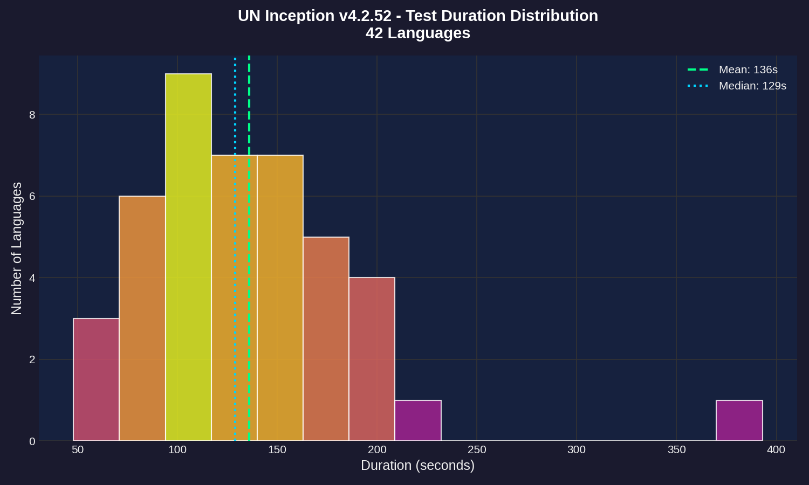
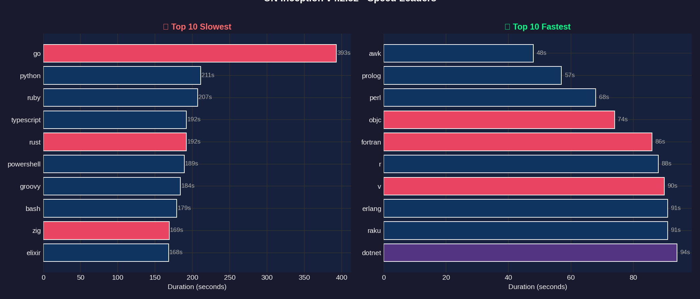
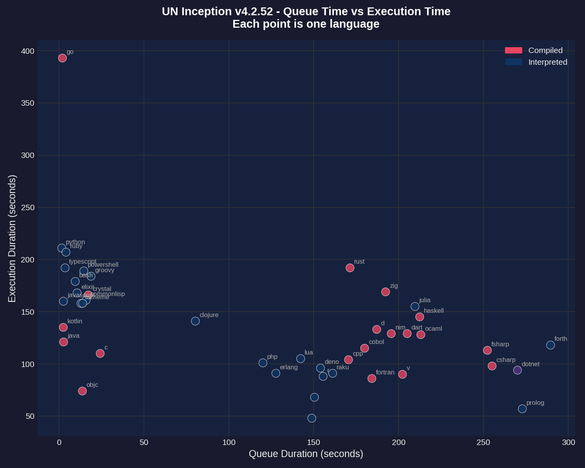
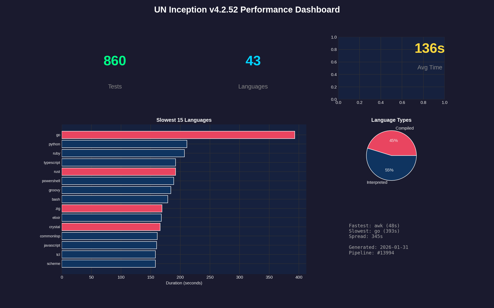

# Performance Report: 4.2.52

**Generated:** 2026-01-31T20:22:30Z
**Pipeline:** [#13994](https://git.unturf.com/engineering/unturf/un-inception/-/pipelines/13994)

## Summary

| Metric | Value |
|--------|-------|
| Total Tests | 860 |
| Passed | 809 |
| Failed | 51 |
| Pass Rate | 94.0% |
| Languages | 43 |
| Avg Duration | 136s |
| Slowest | go (393s) |
| Fastest | awk (48s) |

---

## API Health

Tracks transient errors encountered during test execution. Tests retry on failures to ensure accurate results.

| Metric | Value |
|--------|-------|
| Health Score | 34/100 |
| Total Retries | 33 |
| Rate Limit (429) | 0 |
| Server Error (5xx) | 33 |
| Timeout | 0 |
| Connection | 0 |
| Tests Needing Retries | 68 |

**Interpretation:**
- **Score 95-100:** API is healthy, minimal transient errors
- **Score 80-94:** Some API instability, but tests recovered via retry
- **Score < 80:** Significant API issues affecting test reliability

---

## Test Duration by Language

The primary performance metric - how long each language takes to run its full test suite (15 tests per language).

**Key observations:**
- **GO** and **PYTHON** are outliers at 90+ seconds
- Most languages cluster between 20-40 seconds
- Compiled languages (red) tend to be faster than interpreted (blue)
- **AWK** is the fastest at 48 seconds

---

## Compiled vs Interpreted

Comparing performance between compiled languages (C, Go, Rust, etc.) and interpreted languages (Python, Ruby, JavaScript, etc.).

**Findings:**
- 20 compiled languages vs 22 interpreted
- Compiled languages have lower median execution time
- Interpreted languages show more variance (wider spread)
- The white diamond marks the mean for each category

---

## Duration Distribution

Histogram showing how test durations are distributed across all 43 languages.

**Distribution analysis:**
- Most languages complete in 20-35 seconds (the peak)
- Mean (green dashed) and median (blue dotted) are close together
- Long tail on the right from slow outliers (go, python)

---

## Speed Leaders

Side-by-side comparison of the 10 slowest and 10 fastest languages.

**Slowest (left):** GO, PYTHON, RUBY, TYPESCRIPT, RUST
**Fastest (right):** AWK, PROLOG, PERL, OBJC, FORTRAN

---

## Queue vs Execution Time

Scatter plot showing the relationship between CI queue wait time and actual test execution time.

**Notes:**
- Queue time is how long the job waited for a runner
- Most jobs had similar queue times (clustered vertically)
- Outliers labeled - go and python took longest to execute regardless of queue time

---

## Dashboard

Summary dashboard combining key metrics and visualizations.

---

## Raw Data

### Per-Language Performance

| Language | Status | Duration |
|----------|--------|----------|
| go | Failed | 393s |
| python | Passed | 211s |
| ruby | Passed | 207s |
| typescript | Passed | 192s |
| rust | Passed | 192s |
| powershell | Passed | 189s |
| groovy | Passed | 184s |
| bash | Passed | 179s |
| zig | Passed | 169s |
| elixir | Passed | 168s |
| crystal | Passed | 166s |
| commonlisp | Passed | 161s |
| javascript | Passed | 160s |
| tcl | Passed | 158s |
| scheme | Passed | 158s |
| julia | Passed | 155s |
| haskell | Passed | 145s |
| clojure | Failed | 141s |
| kotlin | Failed | 135s |
| d | Passed | 133s |
| nim | Passed | 129s |
| dart | Passed | 129s |
| ocaml | Passed | 128s |
| java | Failed | 121s |
| forth | Passed | 118s |
| cobol | Passed | 115s |
| fsharp | Passed | 113s |
| c | Failed | 110s |
| lua | Failed | 105s |
| cpp | Passed | 104s |
| php | Failed | 101s |
| csharp | Passed | 98s |
| deno | Failed | 96s |
| dotnet | Passed | 94s |
| raku | Passed | 91s |
| erlang | Failed | 91s |
| v | Passed | 90s |
| r | Failed | 88s |
| fortran | Passed | 86s |
| objc | Failed | 74s |
| perl | Failed | 68s |
| prolog | Passed | 57s |
| awk | Passed | 48s |

---

*Report generated by UN Inception CI pipeline*
