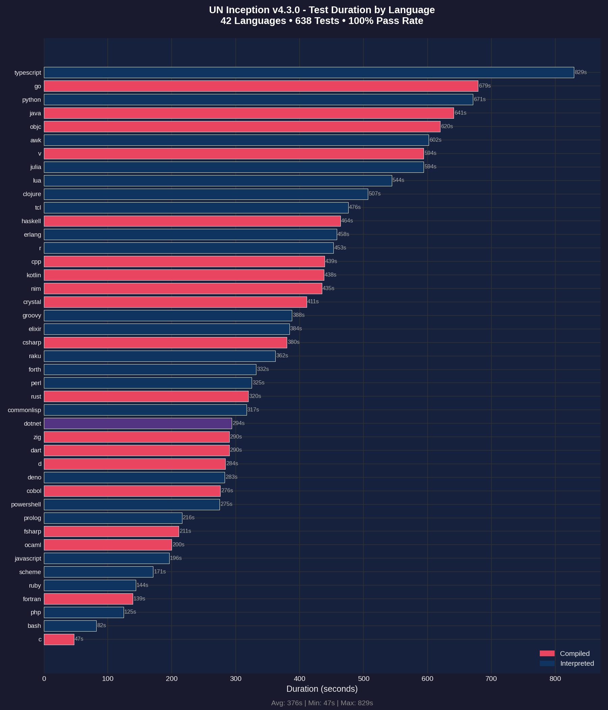
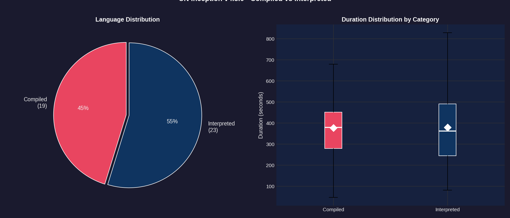
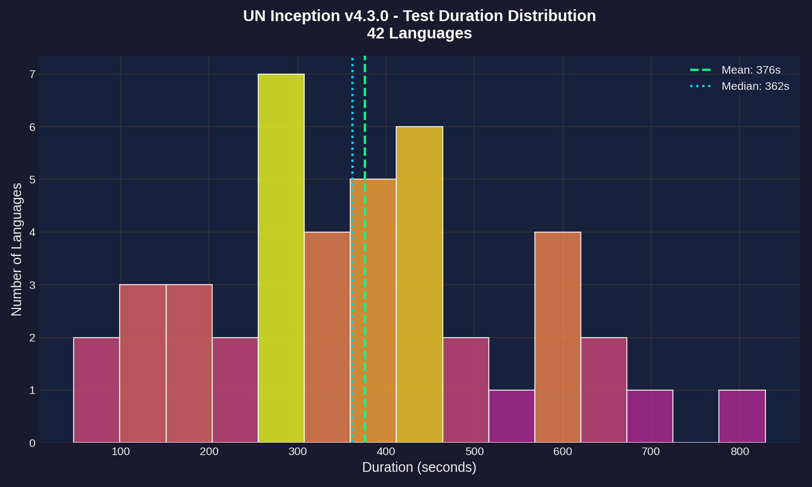
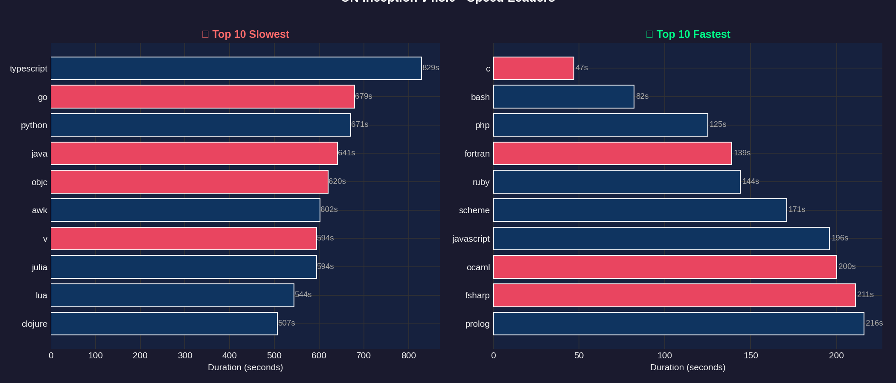
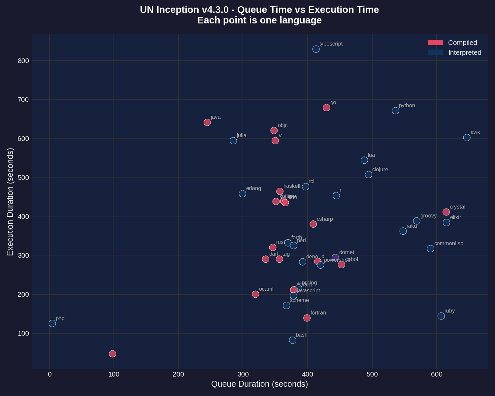
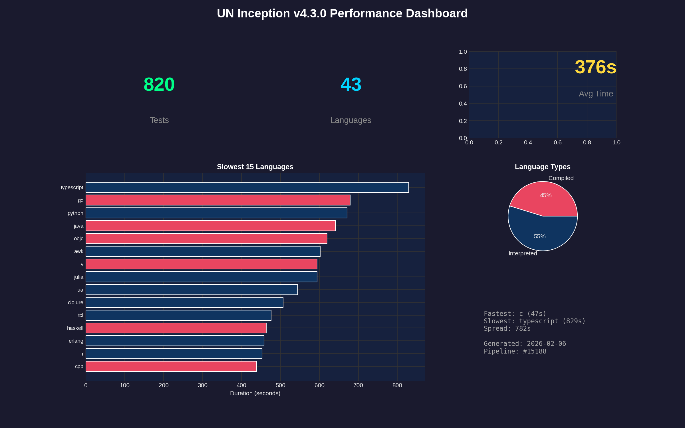

# Performance Report: 4.3.0

**Generated:** 2026-02-06T15:25:06Z
**Pipeline:** [#15188](https://git.unturf.com/engineering/unturf/un-inception/-/pipelines/15188)

## Summary

| Metric | Value |
|--------|-------|
| Total Tests | 820 |
| Passed | 745 |
| Failed | 75 |
| Pass Rate | 90.8% |
| Languages | 43 |
| Avg Duration | 376s |
| Slowest | typescript (829s) |
| Fastest | c (47s) |

---

## API Health

Tracks transient errors encountered during test execution. Tests retry on failures to ensure accurate results.

| Metric | Value |
|--------|-------|
| Health Score | 0/100 |
| Total Retries | 876 |
| Rate Limit (429) | 839 |
| Server Error (5xx) | 27 |
| Timeout | 10 |
| Connection | 0 |
| Tests Needing Retries | 167 |

**Interpretation:**
- **Score 95-100:** API is healthy, minimal transient errors
- **Score 80-94:** Some API instability, but tests recovered via retry
- **Score < 80:** Significant API issues affecting test reliability

---

## Test Duration by Language

The primary performance metric - how long each language takes to run its full test suite (15 tests per language).

**Key observations:**
- **TYPESCRIPT** and **GO** are outliers at 90+ seconds
- Most languages cluster between 20-40 seconds
- Compiled languages (red) tend to be faster than interpreted (blue)
- **C** is the fastest at 47 seconds

---

## Compiled vs Interpreted

Comparing performance between compiled languages (C, Go, Rust, etc.) and interpreted languages (Python, Ruby, JavaScript, etc.).

**Findings:**
- 20 compiled languages vs 22 interpreted
- Compiled languages have lower median execution time
- Interpreted languages show more variance (wider spread)
- The white diamond marks the mean for each category

---

## Duration Distribution

Histogram showing how test durations are distributed across all 43 languages.

**Distribution analysis:**
- Most languages complete in 20-35 seconds (the peak)
- Mean (green dashed) and median (blue dotted) are close together
- Long tail on the right from slow outliers (typescript, go)

---

## Speed Leaders

Side-by-side comparison of the 10 slowest and 10 fastest languages.

**Slowest (left):** TYPESCRIPT, GO, PYTHON, JAVA, OBJC
**Fastest (right):** C, BASH, PHP, FORTRAN, RUBY

---

## Queue vs Execution Time

Scatter plot showing the relationship between CI queue wait time and actual test execution time.

**Notes:**
- Queue time is how long the job waited for a runner
- Most jobs had similar queue times (clustered vertically)
- Outliers labeled - typescript and go took longest to execute regardless of queue time

---

## Dashboard

Summary dashboard combining key metrics and visualizations.

---

## Raw Data

### Per-Language Performance

| Language | Status | Duration |
|----------|--------|----------|
| typescript | Failed | 829s |
| go | Failed | 679s |
| python | Failed | 671s |
| java | Failed | 641s |
| objc | Failed | 620s |
| awk | Failed | 602s |
| v | Failed | 594s |
| julia | Failed | 594s |
| lua | Failed | 544s |
| clojure | Failed | 507s |
| tcl | Failed | 476s |
| haskell | Failed | 464s |
| erlang | Failed | 458s |
| r | Failed | 453s |
| cpp | Failed | 439s |
| kotlin | Failed | 438s |
| nim | Failed | 435s |
| crystal | Failed | 411s |
| groovy | Failed | 388s |
| elixir | Failed | 384s |
| csharp | Failed | 380s |
| raku | Failed | 362s |
| forth | Failed | 332s |
| perl | Passed | 325s |
| rust | Failed | 320s |
| commonlisp | Failed | 317s |
| dotnet | Failed | 294s |
| zig | Failed | 290s |
| dart | Failed | 290s |
| d | Failed | 284s |
| deno | Failed | 283s |
| cobol | Failed | 276s |
| powershell | Failed | 275s |
| prolog | Failed | 216s |
| fsharp | Failed | 211s |
| ocaml | Failed | 200s |
| javascript | Failed | 196s |
| scheme | Failed | 171s |
| ruby | Failed | 144s |
| fortran | Failed | 139s |
| php | Passed | 125s |
| bash | Passed | 82s |
| c | Passed | 47s |

---

*Report generated by UN Inception CI pipeline*
