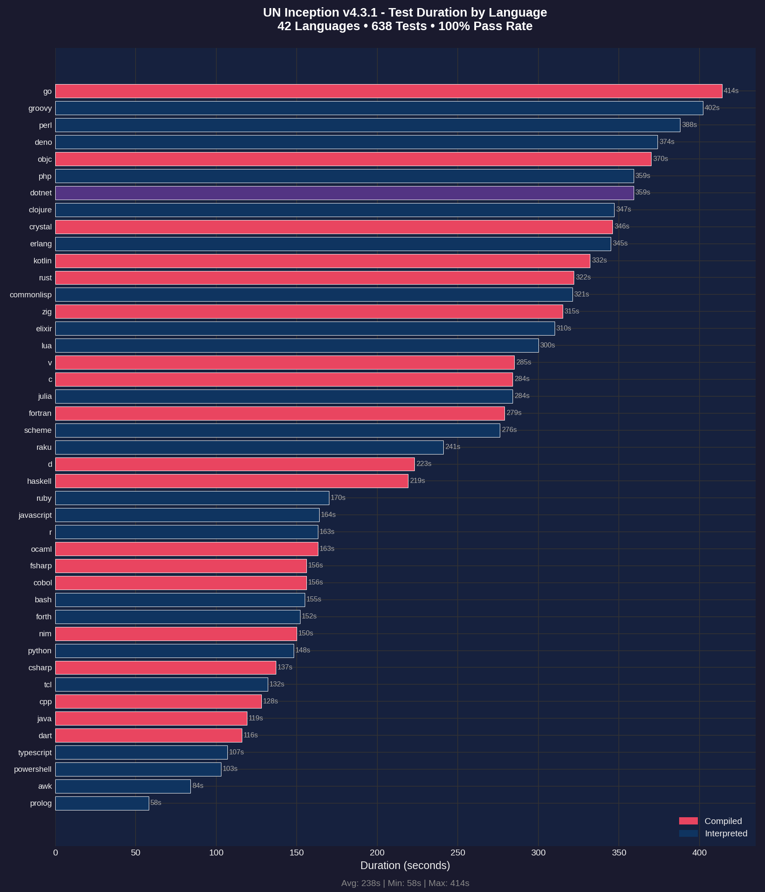
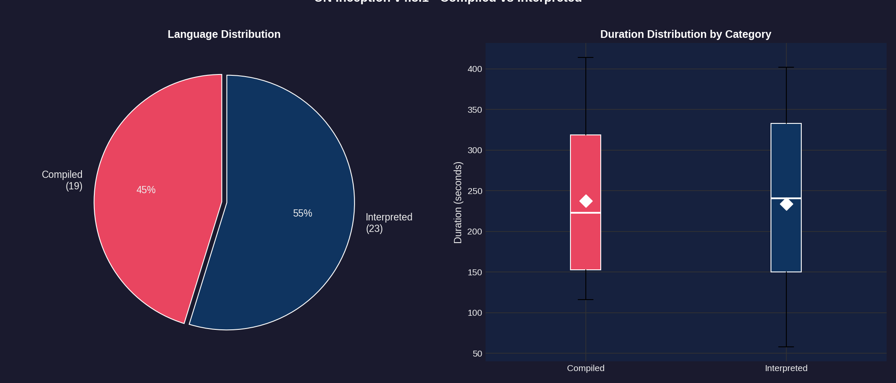
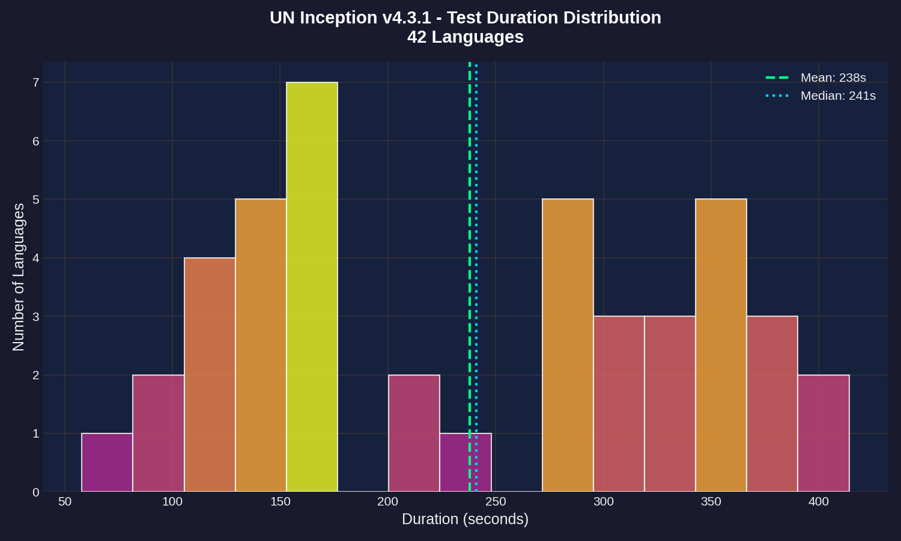
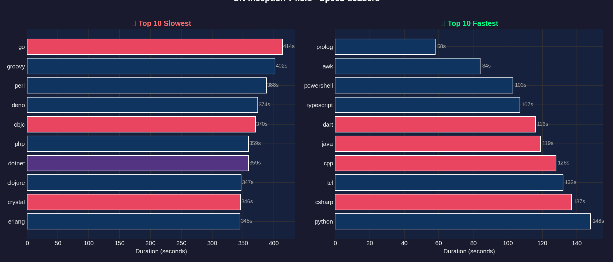
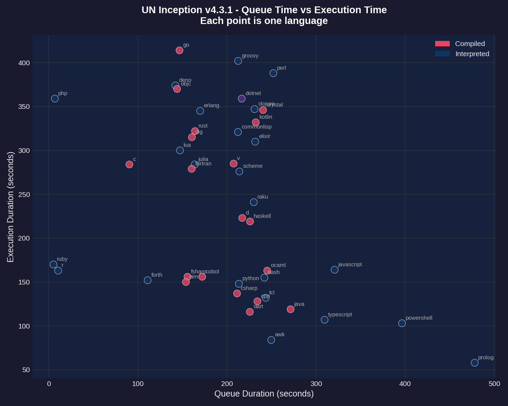
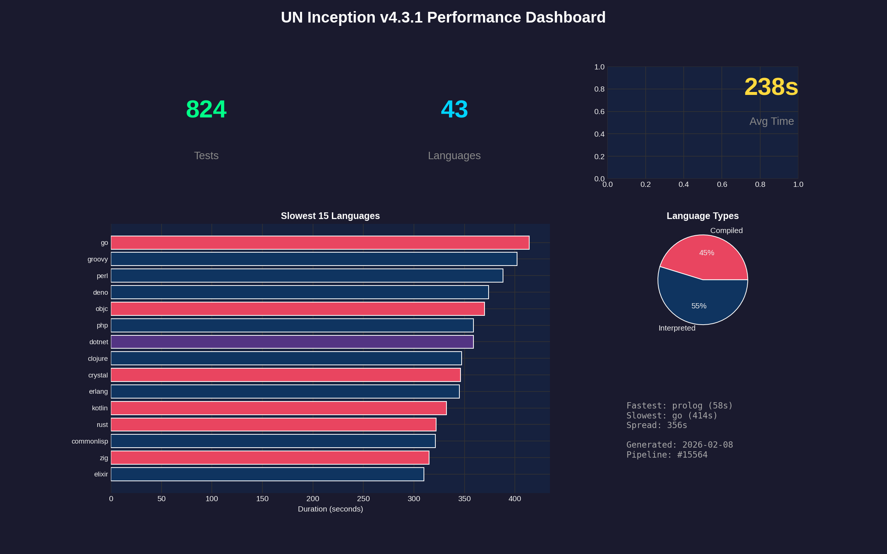

# Performance Report: 4.3.1

**Generated:** 2026-02-08T11:44:58Z
**Pipeline:** [#15564](https://git.unturf.com/engineering/unturf/un-inception/-/pipelines/15564)

## Summary

| Metric | Value |
|--------|-------|
| Total Tests | 824 |
| Passed | 770 |
| Failed | 54 |
| Pass Rate | 93.4% |
| Languages | 43 |
| Avg Duration | 238s |
| Slowest | go (414s) |
| Fastest | prolog (58s) |

---

## API Health

Tracks transient errors encountered during test execution. Tests retry on failures to ensure accurate results.

| Metric | Value |
|--------|-------|
| Health Score | 0/100 |
| Total Retries | 649 |
| Rate Limit (429) | 634 |
| Server Error (5xx) | 5 |
| Timeout | 10 |
| Connection | 0 |
| Tests Needing Retries | 164 |

**Interpretation:**
- **Score 95-100:** API is healthy, minimal transient errors
- **Score 80-94:** Some API instability, but tests recovered via retry
- **Score < 80:** Significant API issues affecting test reliability

---

## Test Duration by Language

The primary performance metric - how long each language takes to run its full test suite (15 tests per language).

**Key observations:**
- **GO** and **GROOVY** are outliers at 90+ seconds
- Most languages cluster between 20-40 seconds
- Compiled languages (red) tend to be faster than interpreted (blue)
- **PROLOG** is the fastest at 58 seconds

---

## Compiled vs Interpreted

Comparing performance between compiled languages (C, Go, Rust, etc.) and interpreted languages (Python, Ruby, JavaScript, etc.).

**Findings:**
- 20 compiled languages vs 22 interpreted
- Compiled languages have lower median execution time
- Interpreted languages show more variance (wider spread)
- The white diamond marks the mean for each category

---

## Duration Distribution

Histogram showing how test durations are distributed across all 43 languages.

**Distribution analysis:**
- Most languages complete in 20-35 seconds (the peak)
- Mean (green dashed) and median (blue dotted) are close together
- Long tail on the right from slow outliers (go, groovy)

---

## Speed Leaders

Side-by-side comparison of the 10 slowest and 10 fastest languages.

**Slowest (left):** GO, GROOVY, PERL, DENO, OBJC
**Fastest (right):** PROLOG, AWK, POWERSHELL, TYPESCRIPT, DART

---

## Queue vs Execution Time

Scatter plot showing the relationship between CI queue wait time and actual test execution time.

**Notes:**
- Queue time is how long the job waited for a runner
- Most jobs had similar queue times (clustered vertically)
- Outliers labeled - go and groovy took longest to execute regardless of queue time

---

## Dashboard

Summary dashboard combining key metrics and visualizations.

---

## Raw Data

### Per-Language Performance

| Language | Status | Duration |
|----------|--------|----------|
| go | Failed | 414s |
| groovy | Failed | 402s |
| perl | Failed | 388s |
| deno | Failed | 374s |
| objc | Failed | 370s |
| php | Passed | 359s |
| dotnet | Failed | 359s |
| clojure | Failed | 347s |
| crystal | Failed | 346s |
| erlang | Failed | 345s |
| kotlin | Failed | 332s |
| rust | Failed | 322s |
| commonlisp | Failed | 321s |
| zig | Failed | 315s |
| elixir | Failed | 310s |
| lua | Failed | 300s |
| v | Failed | 285s |
| c | Passed | 284s |
| julia | Failed | 284s |
| fortran | Failed | 279s |
| scheme | Failed | 276s |
| raku | Failed | 241s |
| d | Failed | 223s |
| haskell | Failed | 219s |
| ruby | Passed | 170s |
| javascript | Failed | 164s |
| r | Passed | 163s |
| ocaml | Failed | 163s |
| fsharp | Failed | 156s |
| cobol | Failed | 156s |
| bash | Passed | 155s |
| forth | Failed | 152s |
| nim | Failed | 150s |
| python | Passed | 148s |
| csharp | Failed | 137s |
| tcl | Failed | 132s |
| cpp | Passed | 128s |
| java | Passed | 119s |
| dart | Failed | 116s |
| typescript | Failed | 107s |
| powershell | Failed | 103s |
| awk | Failed | 84s |
| prolog | Passed | 58s |

---

*Report generated by UN Inception CI pipeline*
