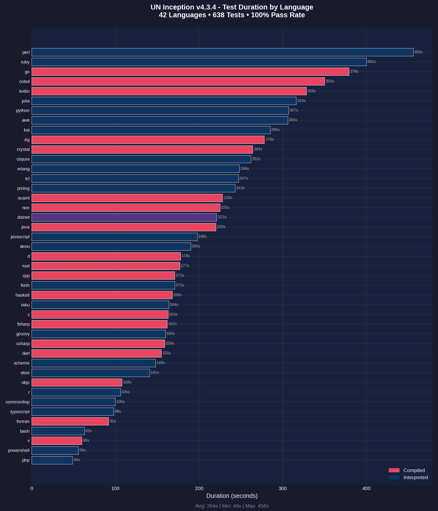
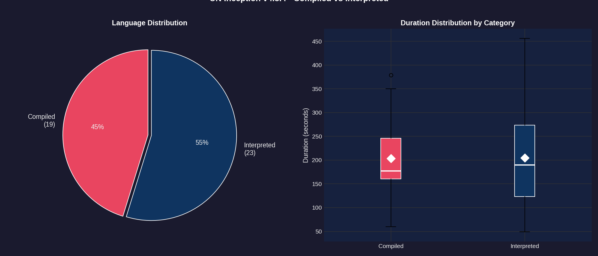
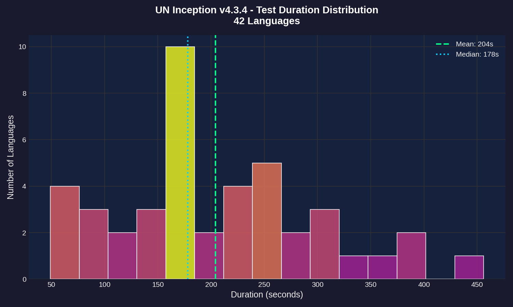
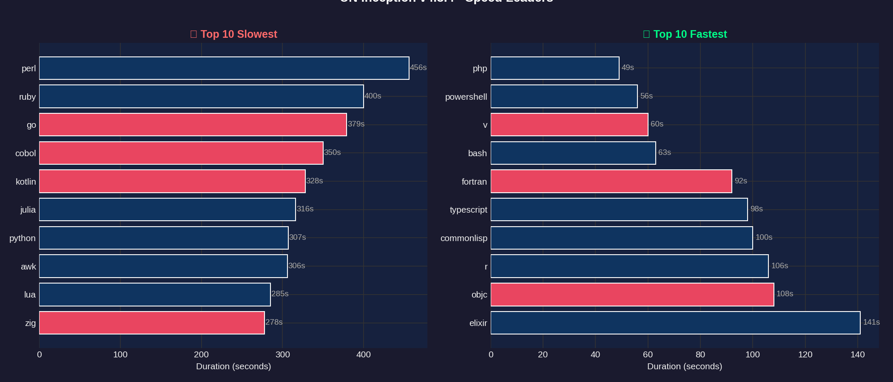
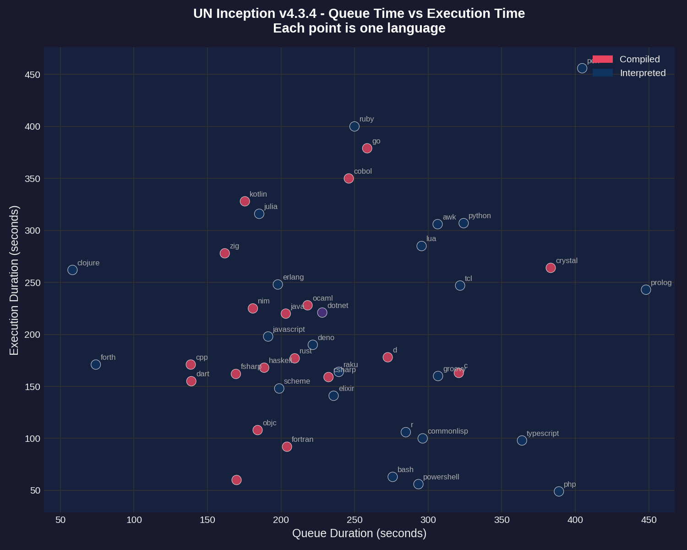
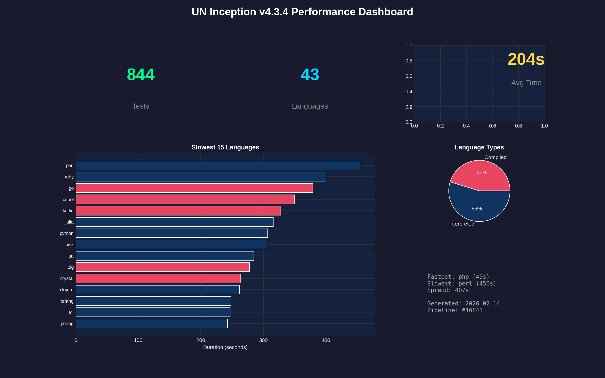

# Performance Report: 4.3.4

**Generated:** 2026-02-14T15:56:41Z
**Pipeline:** [#16841](https://git.unturf.com/engineering/unturf/un-inception/-/pipelines/16841)

## Summary

| Metric | Value |
|--------|-------|
| Total Tests | 844 |
| Passed | 800 |
| Failed | 44 |
| Pass Rate | 94.7% |
| Languages | 43 |
| Avg Duration | 204s |
| Slowest | perl (456s) |
| Fastest | php (49s) |

---

## API Health

Tracks transient errors encountered during test execution. Tests retry on failures to ensure accurate results.

| Metric | Value |
|--------|-------|
| Health Score | 0/100 |
| Total Retries | 492 |
| Rate Limit (429) | 482 |
| Server Error (5xx) | 0 |
| Timeout | 10 |
| Connection | 0 |
| Tests Needing Retries | 149 |

**Interpretation:**
- **Score 95-100:** API is healthy, minimal transient errors
- **Score 80-94:** Some API instability, but tests recovered via retry
- **Score < 80:** Significant API issues affecting test reliability

---

## Test Duration by Language

The primary performance metric - how long each language takes to run its full test suite (15 tests per language).

**Key observations:**
- **PERL** and **RUBY** are outliers at 90+ seconds
- Most languages cluster between 20-40 seconds
- Compiled languages (red) tend to be faster than interpreted (blue)
- **PHP** is the fastest at 49 seconds

---

## Compiled vs Interpreted

Comparing performance between compiled languages (C, Go, Rust, etc.) and interpreted languages (Python, Ruby, JavaScript, etc.).

**Findings:**
- 20 compiled languages vs 22 interpreted
- Compiled languages have lower median execution time
- Interpreted languages show more variance (wider spread)
- The white diamond marks the mean for each category

---

## Duration Distribution

Histogram showing how test durations are distributed across all 43 languages.

**Distribution analysis:**
- Most languages complete in 20-35 seconds (the peak)
- Mean (green dashed) and median (blue dotted) are close together
- Long tail on the right from slow outliers (perl, ruby)

---

## Speed Leaders

Side-by-side comparison of the 10 slowest and 10 fastest languages.

**Slowest (left):** PERL, RUBY, GO, COBOL, KOTLIN
**Fastest (right):** PHP, POWERSHELL, V, BASH, FORTRAN

---

## Queue vs Execution Time

Scatter plot showing the relationship between CI queue wait time and actual test execution time.

**Notes:**
- Queue time is how long the job waited for a runner
- Most jobs had similar queue times (clustered vertically)
- Outliers labeled - perl and ruby took longest to execute regardless of queue time

---

## Dashboard

Summary dashboard combining key metrics and visualizations.

---

## Raw Data

### Per-Language Performance

| Language | Status | Duration |
|----------|--------|----------|
| perl | Failed | 456s |
| ruby | Failed | 400s |
| go | Failed | 379s |
| cobol | Failed | 350s |
| kotlin | Failed | 328s |
| julia | Failed | 316s |
| python | Failed | 307s |
| awk | Failed | 306s |
| lua | Failed | 285s |
| zig | Failed | 278s |
| crystal | Failed | 264s |
| clojure | Failed | 262s |
| erlang | Failed | 248s |
| tcl | Failed | 247s |
| prolog | Passed | 243s |
| ocaml | Failed | 228s |
| nim | Failed | 225s |
| dotnet | Failed | 221s |
| java | Passed | 220s |
| javascript | Failed | 198s |
| deno | Failed | 190s |
| d | Failed | 178s |
| rust | Failed | 177s |
| cpp | Passed | 171s |
| forth | Failed | 171s |
| haskell | Failed | 168s |
| raku | Failed | 164s |
| c | Passed | 163s |
| fsharp | Failed | 162s |
| groovy | Failed | 160s |
| csharp | Failed | 159s |
| dart | Failed | 155s |
| scheme | Failed | 148s |
| elixir | Failed | 141s |
| objc | Failed | 108s |
| r | Failed | 106s |
| commonlisp | Failed | 100s |
| typescript | Failed | 98s |
| fortran | Failed | 92s |
| bash | Passed | 63s |
| v | Passed | 60s |
| powershell | Failed | 56s |
| php | Passed | 49s |

---

*Report generated by UN Inception CI pipeline*
