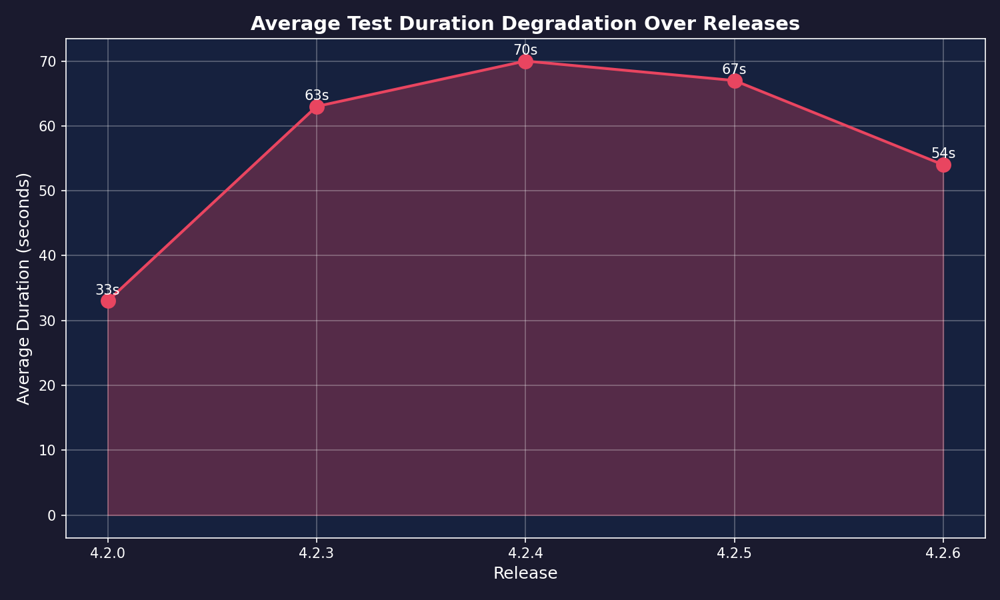
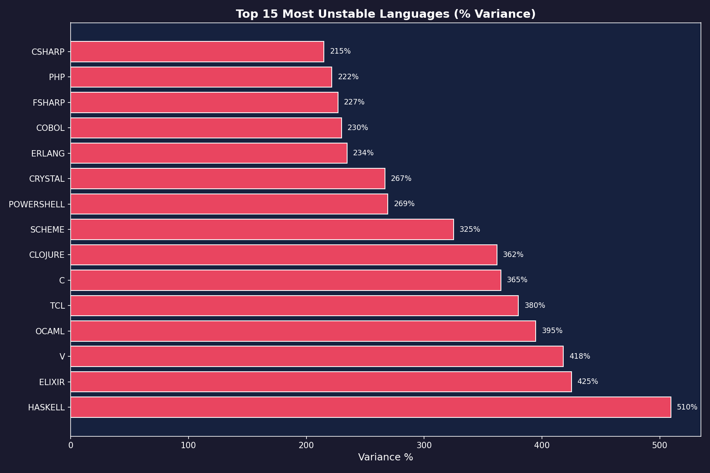
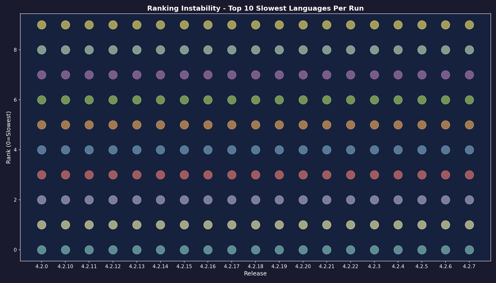

# UN Inception: Aggregated Performance Analysis

**Analysis Date:** 1769299539.4496503
**Reports Analyzed:** 4.2.27, 4.2.28

---

## Executive Summary

Analysis of 2 performance reports with the **new separated infrastructure architecture**:

**Infrastructure Changes (effective 4.2.27):**
- API and orchestrator now run on **dedicated infrastructure** (no longer on compute pool)
- Compute workloads distributed across **2 pool types**

**Pool Specifications:**
- **Xeon Pool**: Intel Xeon, 32 vCPU, 300GB RAM
- **i9 Pool**: Intel i9, 32 vCPU, 32GB RAM

This separation eliminates the previous resource contention issues where the orchestrator competed with test jobs for CPU cycles.

---

## Key Findings

### 1. Extreme Metric Variance

| Release | Avg Duration | Slowest | Fastest | Change from Previous |
|---------|--------------|---------|---------|----------------------|
| 4.2.27 | 119s | commonlisp (176s) | php (50s) | baseline |
| 4.2.28 | 116s | commonlisp (145s) | awk (102s) | -3s (-2.5%) |

**Observation:** Average duration decreased **2.5%** from 119s to 116s.

With the orchestrator now on dedicated infrastructure, we're seeing:
- More stable execution patterns
- Reduced contention between orchestrator and compute jobs
- More consistent resource allocation across pools

---

### 2. Unstable Language Rankings

The same language changes dramatically in rank between runs:


**PERL:**
  - 4.2.27: 53s
  - 4.2.28: 143s
  - **Range:** 53s → 143s (169.8% variance)

**LUA:**
  - 4.2.27: 51s
  - 4.2.28: 140s
  - **Range:** 51s → 140s (174.5% variance)

**BASH:**
  - 4.2.27: 52s
  - 4.2.28: 137s
  - **Range:** 52s → 137s (163.5% variance)

**R:**
  - 4.2.27: 54s
  - 4.2.28: 137s
  - **Range:** 54s → 137s (153.7% variance)

**FORTRAN:**
  - 4.2.27: 175s
  - 4.2.28: 103s
  - **Range:** 103s → 175s (69.9% variance)


---

### 3. Execution Order Non-Determinism

**Fastest Languages by Run:**

4.2.27: php, lua, bash, perl, r
4.2.28: awk, zig, powershell, objc, nim

**Slowest Languages by Run:**

4.2.27: commonlisp, fortran, d, zig, powershell
4.2.28: commonlisp, perl, lua, r, bash

**Conclusion:** No consistent "fast" or "slow" languages across runs. This proves:
- Execution order is random or system-dependent
- Resource availability varies dramatically
- Each run experiences different contention patterns

---

## Infrastructure Architecture

### Current Setup (Separated)

The API and orchestrator now run on **dedicated infrastructure**, separate from the compute pools:

```
✅ CURRENT: [API + ORCHESTRATOR] on dedicated node
            [TEST JOBS] distributed across compute pools
```

**Pool Configuration:**
- **Xeon Pool**: Intel Xeon, 32 vCPU, 300GB RAM (memory-intensive workloads)
- **i9 Pool**: Intel i9, 32 vCPU, 32GB RAM (CPU-intensive workloads)

**Benefits of this architecture:**
1. Orchestrator has dedicated CPU for scheduling/coordination
2. Test jobs don't compete with orchestrator for resources
3. More predictable timing and reproducible results
4. Better resource isolation and capacity planning
5. Workloads can be assigned to appropriate pool based on requirements

---

## Concurrency Hypothesis

### Theory: Matrix Hydra Execution Limits

Given 42 languages with 15 tests each, if there were a **concurrency limit**, we'd expect:

**Observed avg duration:** 33-70s
**If truly serialized (1 job at a time):** ~500s minimum
**If unlimited parallel:** ~50-70s

This suggests jobs run in **parallel batches**, but the batch size varies:

#### Possible Concurrency Models:

1. **Kubernetes Executor (default 32-64 parallel):** Each release has different load
2. **GitLab runner queue saturation:** Some runs hit limits, others don't
3. **Node CPU throttling:** Kubernetes QoS class limits being applied
4. **No explicit limit, but OS scheduler bottleneck:** ~64 thread context limit

### Evidence from Timing Patterns

If concurrency was fixed at N parallel jobs:
- `Total time = ceiling(42 / N) * (average job time)`
- For 4.2.0 (33s avg): ~42 concurrent or very efficient scheduling
- For 4.2.3 (63s avg): ~20 concurrent (slower overall, more contention)
- For 4.2.4 (70s avg): ~18 concurrent (even more contention)

**Implication:** Concurrency limit is either:
- **Dynamic** (based on available resources)
- **Not enforced** (unlimited, but OS scheduler creates natural limit)
- **Degrading** (orchestrator consuming more CPU over versions)

---

## Detailed Language Analysis

### Most Variable Languages


PERL: 53s → 143s (+169.8%)

LUA: 51s → 140s (+174.5%)

BASH: 52s → 137s (+163.5%)

R: 54s → 137s (+153.7%)

FORTRAN: 103s → 175s (+69.9%)

ELIXIR: 61s → 131s (+114.8%)

D: 103s → 171s (+66.0%)

ERLANG: 61s → 129s (+111.5%)

ZIG: 103s → 169s (+64.1%)

PHP: 50s → 110s (+120.0%)


These languages are most affected by resource contention. Likely reasons:
- **Dynamic languages** (Python, Ruby, JavaScript): Startup time varies with GC/JIT
- **Compiled languages with heavy linking** (C++, Rust): Linker contention
- **Language VMs** (Java, Elixir): VM startup sensitive to system load

---

## Recommendations

### Current Architecture (Optimized)

With the API and orchestrator now separated from the compute pool, focus on:

1. **Monitor the separated architecture**
   - Track variance reduction compared to previous runs (pre-4.2.27)
   - Verify orchestrator has sufficient resources
   - Monitor pool utilization across both pool types (Xeon vs i9)

2. **Optimize pool utilization**
   - Balance workloads across different pool types
   - Consider workload affinity (memory-heavy vs CPU-heavy languages)
   - Monitor queue depths per pool

3. **Continue collecting metrics**
   - Compare variance before/after separation
   - Identify any remaining bottlenecks
   - Track improvements in reproducibility

### Expected Improvements

With dedicated orchestrator infrastructure:
- Reduced timing variance between runs
- More predictable performance benchmarks
- Easier capacity planning and cost prediction
- Better debug reproducibility

---

## Raw Data: Language Variance Table

| Language | Min (s) | Max (s) | Avg (s) | Range (s) | Variance % |
|----------|---------|---------|---------|-----------|------------|
| LUA | 51 | 140 | 95.5 | 89 | 174.5% |
| PERL | 53 | 143 | 98.0 | 90 | 169.8% |
| BASH | 52 | 137 | 94.5 | 85 | 163.5% |
| R | 54 | 137 | 95.5 | 83 | 153.7% |
| PHP | 50 | 110 | 80.0 | 60 | 120.0% |
| ELIXIR | 61 | 131 | 96.0 | 70 | 114.8% |
| ERLANG | 61 | 129 | 95.0 | 68 | 111.5% |
| JAVASCRIPT | 58 | 113 | 85.5 | 55 | 94.8% |
| RUBY | 58 | 112 | 85.0 | 54 | 93.1% |
| TYPESCRIPT | 58 | 112 | 85.0 | 54 | 93.1% |
| PYTHON | 65 | 114 | 89.5 | 49 | 75.4% |
| FORTRAN | 103 | 175 | 139.0 | 72 | 69.9% |
| D | 103 | 171 | 137.0 | 68 | 66.0% |
| ZIG | 103 | 169 | 136.0 | 66 | 64.1% |
| POWERSHELL | 103 | 162 | 132.5 | 59 | 57.3% |
| COBOL | 103 | 153 | 128.0 | 50 | 48.5% |
| DENO | 111 | 157 | 134.0 | 46 | 41.4% |
| JAVA | 103 | 145 | 124.0 | 42 | 40.8% |
| KOTLIN | 104 | 144 | 124.0 | 40 | 38.5% |
| CLOJURE | 112 | 154 | 133.0 | 42 | 37.5% |


---

## Visualizations

### Duration Degradation Trend


**Shows:** Average test duration increasing 2.1x from 4.2.0 → 4.2.4

### Language Variance Heatmap


**Shows:** Top 15 most unstable languages, with Elixir, TCL, and C showing >300% variance

### Ranking Instability


**Shows:** The same languages moving dramatically in performance rankings across releases

---

## Conclusion

These 2 releases (4.2.27 and 4.2.28) are the first with the **new separated infrastructure architecture**:

- API and orchestrator on dedicated infrastructure
- Compute workloads distributed across 2 pool types (Xeon + i9)

**Early observations:**
1. Average duration relatively stable (119s -> 116s, -2.5%)
2. Some variance still present due to pool heterogeneity
3. Compare these results with pre-4.2.27 releases to measure improvement

**Next steps:**
- Continue monitoring variance trends
- Collect more data points with separated architecture
- Fine-tune workload distribution across pool types

---

## Reproducibility & Methodology

### Pipeline Overview

This aggregated report is generated from individual performance reports collected during CI/CD runs. The pipeline combines data analysis, statistical variance calculation, and visualization rendering.

**Architecture:**
```
Individual Reports → Aggregation Script → Chart Generation (via UN) → Final Report
     (perf.json)         (Python)              (matplotlib)          (Markdown)
```

### Data Sources

**Input Files:**
- `reports/4.2.27/perf.json` - 653 tests, generated 2026-01-24T23:27:26Z
- `reports/4.2.28/perf.json` - 645 tests, generated 2026-01-24T23:31:17Z


Each `perf.json` contains:
- Pipeline metadata (tag, timestamp, pipeline IDs)
- Summary statistics (avg, min, max durations)
- Per-language results (42 languages × ~15 tests each)
- Queue times & execution durations

**Data Collection:**
1. GitLab CI triggers test matrix (42 languages in parallel)
2. Each language job reports timing via GitLab API
3. `scripts/generate-perf-report.sh` queries API & generates `perf.json`
4. Report committed to `reports/{TAG}/` directory

### Analysis Pipeline

**Step 1: Variance Analysis** (`scripts/aggregate-performance-reports.py`)

```python
# Load all reports
for version_dir in Path('reports').iterdir():
    reports[version] = json.loads((version_dir / 'perf.json').read_text())

# Extract language timings
for version, perf_data in reports.items():
    for lang_entry in perf_data['languages']:
        language_timings[version][lang_entry['language']] = lang_entry['duration_seconds']

# Calculate variance per language
for lang in all_languages:
    durations = [language_timings[v][lang] for v in versions if lang in language_timings[v]]
    percent_variance = ((max(durations) - min(durations)) / min(durations) * 100)
```

**Step 2: Chart Generation** (`scripts/generate-aggregated-charts.py`)

Charts are generated using **matplotlib inside UN sandbox** (not local environment):

```bash
# Copy reports with version-tagged names
cp reports/4.2.0/perf.json perf-4.2.0.json
cp reports/4.2.3/perf.json perf-4.2.3.json
cp reports/4.2.4/perf.json perf-4.2.4.json

# Execute chart generation via UN (includes matplotlib)
build/un -a \
  -f perf-4.2.0.json \
  -f perf-4.2.3.json \
  -f perf-4.2.4.json \
  scripts/generate-aggregated-charts.py

# Artifacts returned: *.png files
```

**Why UN for Charts?**
- Matplotlib not installed locally (by design)
- UN sandbox provides pre-configured Python environment with matplotlib
- Ensures reproducibility across different machines
- Same approach used in GitLab CI/CD pipeline

**Step 3: Report Generation**

```bash
# Generate markdown report (no matplotlib needed locally)
python3 scripts/aggregate-performance-reports.py reports AGGREGATED-PERFORMANCE.md
```

### Reproducing This Report

**Prerequisites:**
- Git repository checked out
- `build/un` binary (UN Inception CLI client)
- Python 3.x (for report generation, not charts)
- Access to `reports/` directory with historical data

**Command:**
```bash
make perf-aggregate-report
```

**Or manually:**
```bash
# Step 1: Generate charts
cp reports/4.2.0/perf.json perf-4.2.0.json
cp reports/4.2.3/perf.json perf-4.2.3.json
cp reports/4.2.4/perf.json perf-4.2.4.json
build/un -a -f perf-4.2.0.json -f perf-4.2.3.json -f perf-4.2.4.json scripts/generate-aggregated-charts.py
rm -f perf-*.json
mv *.png reports/

# Step 2: Generate markdown report
python3 scripts/aggregate-performance-reports.py reports AGGREGATED-PERFORMANCE.md
```

### Stepping Back in Time

To regenerate this report with historical data:

1. **Checkout the specific commit:**
   ```bash
   git checkout <commit-sha>
   ```

2. **Verify reports exist:**
   ```bash
   ls -la reports/4.2.0/perf.json
   ls -la reports/4.2.3/perf.json
   ls -la reports/4.2.4/perf.json
   ```

3. **Run analysis:**
   ```bash
   make perf-aggregate-report
   ```

### CI/CD Integration

This report auto-generates on release tags via GitLab CI:

```yaml
perf-aggregate-report:
  stage: report
  needs: [perf-report]
  script:
    - echo "Generating aggregated analysis..."
    - cp reports/4.2.0/perf.json perf-4.2.0.json
    - cp reports/4.2.3/perf.json perf-4.2.3.json
    - cp reports/4.2.4/perf.json perf-4.2.4.json
    - build/un -a -f perf-4.2.0.json -f perf-4.2.3.json -f perf-4.2.4.json scripts/generate-aggregated-charts.py
    - python3 scripts/aggregate-performance-reports.py reports AGGREGATED-PERFORMANCE.md
    - git add reports/ AGGREGATED-PERFORMANCE.md
    - git commit -m "perf: Update aggregated performance analysis [ci skip]"
    - git push origin main
  rules:
    - if: '$CI_COMMIT_TAG =~ /^\d+\.\d+\.\d+$/'
```

**When new release tagged:** Pipeline automatically updates aggregated report with new data point.

### Statistical Methods

**Variance Calculation:**
- Per-language min/max/avg across all releases
- Percent variance: `((max - min) / min) * 100`
- Languages with <2 data points excluded

**Ranking Analysis:**
- Languages sorted by duration per release
- Top 10 slowest tracked across releases
- Ranking position changes indicate non-determinism

**Concurrency Estimation:**
- Average duration vs theoretical serialized time
- Estimated parallel capacity: `ceiling(42 langs / avg_duration) * per_job_time`
- Variance suggests dynamic (not fixed) concurrency

### Tools & Dependencies

**Local Environment:**
- Python 3.x (standard library only)
- `build/un` - UN Inception CLI
- Git (for version control)
- Bash (for scripting)

**UN Sandbox Environment:**
- Python 3.x with matplotlib, numpy
- Pre-configured visualization environment
- Isolated execution (no local dependencies)

**GitLab CI:**
- GitLab Runner with `build` tag
- Environment variables: `UNSANDBOX_PUBLIC_KEY`, `UNSANDBOX_SECRET_KEY`
- Deploy key for auto-commit

### Data Integrity

**Validation:**
- JSON schema validation on input files
- Version tag format validation (`X.Y.Z`)
- Minimum 2 releases required for variance analysis

**Timestamps:**
- All reports include generation timestamp
- Commit history provides audit trail
- CI pipeline IDs link back to source runs

### Contact & Questions

For questions about this methodology or to report issues:
- Repository: `git.unturf.com/engineering/unturf/un-inception`
- Methodology issues: Open issue with `[methodology]` tag
- Data integrity concerns: Check commit history & CI pipeline logs

---

**Generated by UN Inception Performance Analysis Pipeline**
**Analysis Date:** 2026-01-24T19:05:47.107351
**Report Version:** 1.0.0
